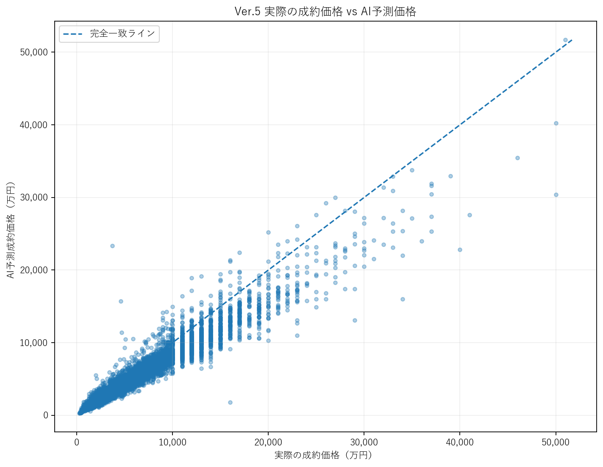
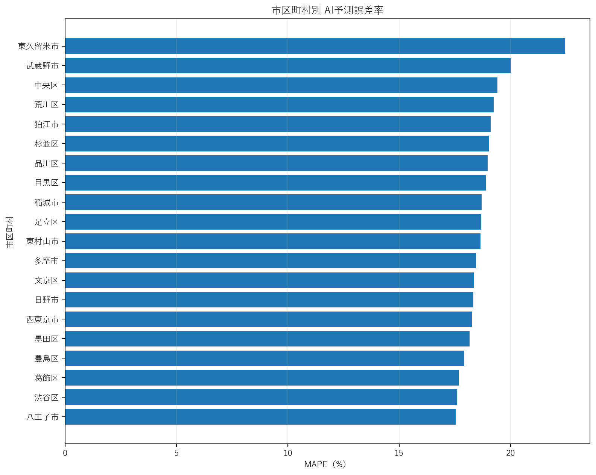
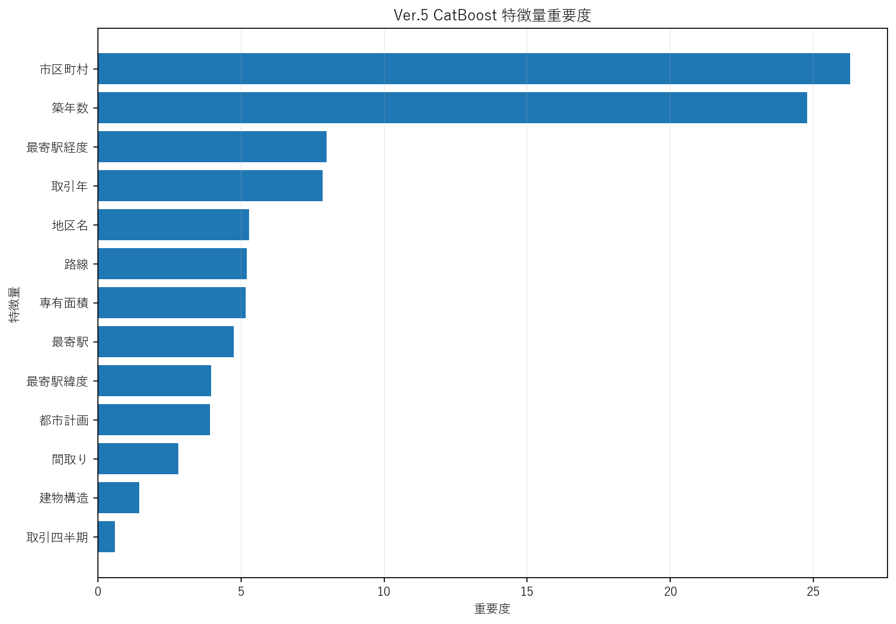

# 🏢 Tokyo Real Estate AI

東京都の中古マンションを対象に、**想定成約価格の予測・売出価格との比較・分析レポート生成**を行う機械学習システムです。

国土交通省「不動産情報ライブラリ API」から取得した実際の不動産取引データを使用し、Python / pandas / CatBoost を用いて、データ取得・前処理・特徴量生成・モデル学習・評価・CSV / Excel予測・分析可視化までを一連で実装しています。

また、**成約日数予測モデル**についても、学習用テンプレート・前処理・学習コードまで実装済みで、実成約データの確保後に学習できる構成にしています。

---

## 📌 現在の実装状況

| 機能 | 状態 |
|---|---|
| 国交省APIから価格データ取得 | ✅ 完成 |
| データクレンジング・前処理 | ✅ 完成 |
| 価格予測モデル | ✅ 完成 |
| CSVによる新規物件予測 | ✅ 完成 |
| Excel入力・Excel出力 | ✅ 完成 |
| 特徴量比較・モデル改善 | ✅ 完成 |
| 分析レポート・グラフ生成 | ✅ 完成 |
| 成約日数学習データ前処理 | ✅ 完成 |
| 成約日数モデル学習コード | ✅ 完成 |
| 成約日数モデル本学習 | ⏳ 実成約データ待ち |

---

## 🎯 目的

不動産会社の査定・売出価格設定・価格改定判断を支援することを想定し、物件条件から以下を算出します。

- AI想定成約価格
- AI想定㎡単価
- 売出価格との差額
- 売出価格との乖離率
- 価格評価（割安 / 適正 / やや割高 / 割高）

将来的には、価格AIの推定適正価格と売出価格の乖離率を利用し、**成約までの日数**も予測できる2段階モデルを目指しています。

```text
物件条件
   ↓
価格予測AI
   ↓
AI推定適正価格
   ↓
売出価格との乖離率
   ↓
成約日数予測AI
   ↓
予想成約日数
```

---

## 🛠 使用技術

### Language

- Python 3

### Libraries

- pandas
- NumPy
- requests
- python-dotenv
- CatBoost
- scikit-learn
- openpyxl
- matplotlib

### Data Source

- 国土交通省 不動産情報ライブラリ API

### Development / Version Control

- Visual Studio Code
- Git
- GitHub

---

## 🤖 価格予測モデル

価格予測には `CatBoostRegressor` を使用しています。

成約価格を直接予測するのではなく、**成約㎡単価を予測し、専有面積を掛けて最終価格を算出する構成**です。

```text
物件情報
   ↓
CatBoost
   ↓
予測㎡単価
   ↓
予測㎡単価 × 専有面積
   ↓
AI予測成約価格
```

目的変数は成約㎡単価を対数変換した値です。

```text
log_contract_price_per_m2
```

---

## 📊 最終モデル精度

2021〜2024年を学習、2025年を検証・モデル選択に使用し、その後2021〜2025年で再学習して2026年データで最終評価しています。

| 指標 | 最終テスト結果 |
|---|---:|
| MAE | 12,485,825円 |
| RMSE | 19,641,775円 |
| MAPE | **17.71%** |
| R² | **0.8528** |
| ㎡単価 MAE | 201,196円/㎡ |
| ㎡単価 MAPE | **17.71%** |

---

## 📈 モデル改善履歴

複数回の評価・特徴量設計・モデル選択を行い、精度を改善しました。

| Version | Test MAPE | Test R² |
|---|---:|---:|
| Ver.1 | 22.26% | 0.7453 |
| Ver.2 | 21.60% | 0.7469 |
| Ver.3 | 21.38% | 0.7560 |
| **Ver.4** | **17.71%** | **0.8528** |

Ver.4では複数の特徴量セットを比較し、検証データで最も性能の良かった `name_compact` を採用しました。

単純に高い検証精度だけを採用せず、**2026年の未使用テストデータで最終性能を確認すること**を重視しました。

---

## 🔍 主要特徴量

最終モデルの特徴量重要度上位は以下です。

| 特徴量 | Importance |
|---|---:|
| 市区町村 | 35.67 |
| 築年数 | 26.65 |
| 地区名 | 10.19 |
| 取引年 | 8.48 |
| 専有面積 | 6.13 |
| 都市計画 | 5.38 |
| 間取り | 3.82 |
| 建物構造 | 2.87 |
| 取引四半期 | 0.80 |

---

## 📉 分析レポート

`analysis_report.py` により、テストデータの予測結果を自動分析し、CSVと日本語グラフを生成します。

生成内容：

- 実際の成約価格 vs AI予測価格
- 予測誤差率の分布
- 市区町村別MAPE
- 成約価格帯別MAPE
- 特徴量重要度 TOP10
- 成約価格と予測誤差率の関係

### 実際の成約価格 vs AI予測価格



### 市区町村別 AI予測誤差率



### 価格予測に重要な特徴量



---

## 🏠 新規物件予測

### CSV予測

`data/input/prediction_input.csv` に物件情報を入力します。

```csv
property_id,city,district_name,area_m2,floor_plan,building_age,structure,renovation,use,city_planning,coverage_ratio,floor_area_ratio,transaction_year,transaction_quarter,asking_price
A001,足立区,千住,65.2,3LDK,12,RC,未改装,住宅,商業地域,80,400,2026,3,45000000
```

実行：

```bash
python main.py predict
```

出力：

```text
output/price_predictions.csv
```

### Excel予測

Excel入力にも対応しています。

```bash
python main.py excel
```

入力：

```text
data/input/prediction_input.xlsx
```

出力：

```text
output/price_predictions.xlsx
```

Excel出力には以下を含みます。

- AI予測㎡単価
- AI予測成約価格
- 売出価格との差額
- 価格乖離率
- 価格評価
- モデル情報

---

## 💡 予測例

### 足立区 千住

| 項目 | 結果 |
|---|---:|
| 専有面積 | 65.2㎡ |
| AI予測㎡単価 | 856,766円/㎡ |
| AI予測成約価格 | 55,861,147円 |
| 売出価格 | 45,000,000円 |
| 価格乖離率 | -19.44% |

### 世田谷区 三軒茶屋

| 項目 | 結果 |
|---|---:|
| AI予測成約価格 | 58,601,201円 |
| 売出価格 | 60,000,000円 |
| 価格乖離率 | 2.39% |

### 港区 六本木

| 項目 | 結果 |
|---|---:|
| AI予測成約価格 | 132,054,525円 |
| 売出価格 | 120,000,000円 |
| 価格乖離率 | -9.13% |

---

## ⏱ 成約日数予測

成約日数モデル用のコード基盤も実装しています。

```text
contract_history.xlsx
        ↓
preprocessing_days.py
        ↓
既存の価格AIで適正価格を推定
        ↓
売出価格との価格乖離率を生成
        ↓
days_training.csv
        ↓
train_days.py
        ↓
days_model.cbm
```

現在は実成約データが不足しているため、`train_days.py` は **100件未満のデータでは学習を停止する設計**です。

サンプルデータだけで見かけ上の精度を算出しないようにしています。

学習に必要な主な実データ：

- 販売開始日
- 初回売出価格
- 成約日
- 成約価格
- 市区町村 / 地区
- 専有面積
- 間取り
- 築年数

実データ確保後は以下で学習できます。

```bash
python main.py days-full
```

---

## 🗂 ディレクトリ構成

```text
real_estate_ai/
├─ data/
│  ├─ raw/
│  ├─ processed/
│  └─ input/
│     ├─ prediction_input.csv
│     ├─ prediction_input.xlsx
│     └─ contract_history.xlsx
│
├─ models/
│  ├─ price_model.cbm
│  └─ days_model.cbm
│
├─ output/
│  ├─ analysis/
│  │  ├─ actual_vs_predicted.png
│  │  ├─ error_distribution.png
│  │  ├─ city_mape.png
│  │  ├─ price_band_mape.png
│  │  ├─ feature_importance.png
│  │  └─ error_by_price.png
│  │
│  ├─ price_model_metrics.json
│  ├─ price_feature_importance.csv
│  ├─ price_feature_set_comparison.csv
│  ├─ price_predictions.csv
│  └─ price_predictions.xlsx
│
├─ collect_mlit.py
├─ preprocessing.py
├─ train_price.py
├─ predict.py
├─ predict_excel.py
├─ analysis_report.py
├─ create_days_template.py
├─ preprocessing_days.py
├─ train_days.py
├─ main.py
├─ requirements.txt
├─ .gitignore
└─ README.md
```

> `days_model.cbm` は成約日数用の実データ確保後に生成されます。

---

## ▶ セットアップ

### 1. Clone

```bash
git clone https://github.com/Rion-rion/real-estate-ai.git
cd real-estate-ai
```

### 2. ライブラリインストール

```bash
pip install -r requirements.txt
```

### 3. APIキー設定

プロジェクト直下に `.env` を作成します。

```env
MLIT_API_KEY=YOUR_API_KEY
```

`.env` はGit管理対象外です。

---

## ▶ main.py コマンド

コマンド一覧：

```bash
python main.py
```

### 価格予測

```bash
python main.py collect
python main.py preprocess
python main.py train
python main.py predict
python main.py excel
python main.py report
python main.py price-full
```

### 成約日数予測

```bash
python main.py days-template
python main.py days-preprocess
python main.py days-train
python main.py days-full
```

### 全体実行

```bash
python main.py all
```

`all` 実行時、成約日数用の実データが不足している場合は価格AIのみ完成させ、成約日数AIは学習を停止します。

---

## 🔐 セキュリティ・再現性

- APIキーは `.env` で管理
- `.env` は `.gitignore` 対象
- 学習元の raw / processed データはGit管理対象外
- モデル評価結果をJSON / CSVで保存
- 特徴量比較結果を保存
- Git / GitHubによるバージョン管理
- 同一モデル・同一入力で再現可能な構成

---

## ⚠ 現在の制約

価格モデルでは現在、以下の特徴量を利用していません。

- 最寄駅
- 駅徒歩分数
- 緯度・経度
- 所在階
- 周辺施設
- 地価
- 金利
- マクロ経済指標

特に位置・駅関連情報の追加による精度改善余地があります。

また、予測価格は不動産価格を保証するものではなく、**査定・販売戦略を補助する参考値**としての利用を想定しています。

---

## 🚀 今後の改善予定

- 最寄駅・駅徒歩時間の特徴量追加
- 緯度・経度情報の追加
- 地価データとの結合
- 成約日数用の実データ確保・モデル本学習
- Web UI
- REST API化
- Docker対応
- AWS / GCPへのデプロイ
- CI / テスト自動化

---

## 📌 開発で意識した点

- データリーク防止
- 時系列を考慮した学習 / 検証 / テスト分割
- 未使用テストデータによる最終評価
- 特徴量セット比較
- モデル改善過程の記録
- 異常値・欠損値処理
- 特徴量重要度の分析
- 市区町村別 / 価格帯別の誤差分析
- CSV / Excelの両方に対応
- APIキーの環境変数管理
- 実データ不足時に学習を停止する安全設計
- 再現可能なPython環境構築

---

## 📄 License

This project is created for portfolio and learning purposes.