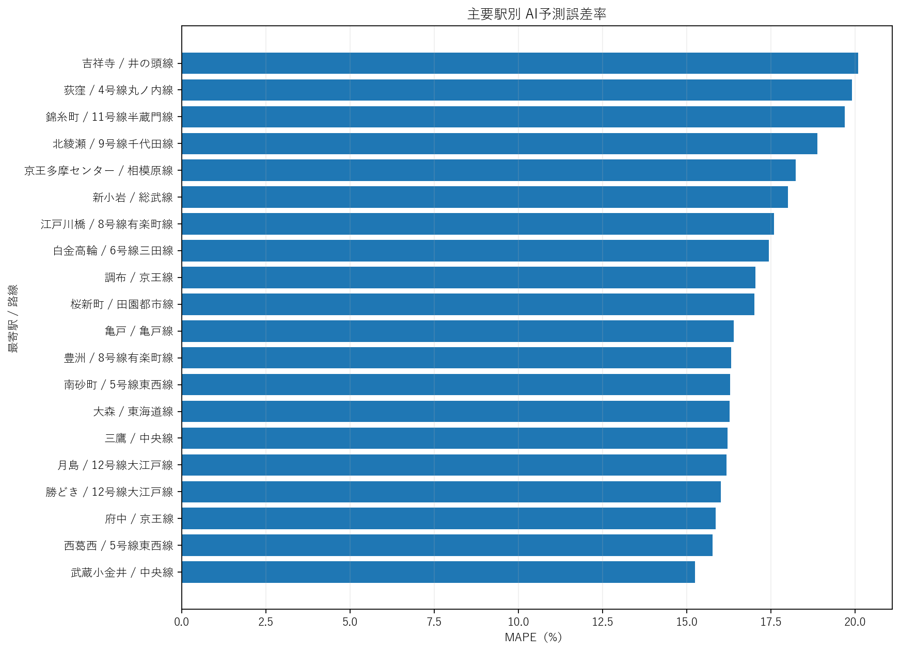
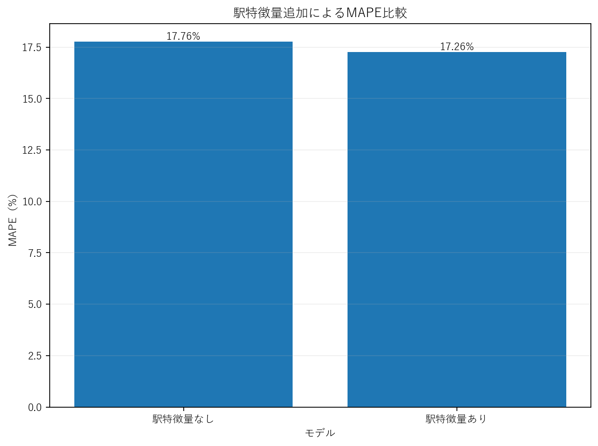

# 🏢 Tokyo Real Estate AI

東京都の中古マンションを対象に、**AIによる想定成約価格の予測・売出価格との比較・価格評価・分析レポート生成**を行う機械学習システムです。

国土交通省「不動産情報ライブラリ API」から取得した実際の不動産取引データと鉄道駅GISデータを利用し、Python / pandas / CatBoost を用いて、データ取得・前処理・特徴量生成・モデル学習・評価・CSV / Excel予測・分析可視化までを一連で実装しています。

Ver.5では新たに**最寄駅・路線・駅位置情報**を特徴量として導入し、同一データ条件のベースラインモデルと比較して予測精度の改善を確認しました。

また、成約日数予測モデルについても、学習用テンプレート・前処理・学習コードまで実装しており、実成約履歴データの確保後に学習できる構成にしています。

---

## 📌 現在の実装状況

| 機能 | 状態 |
|---|---|
| 国交省APIから不動産データ取得 | ✅ 完成 |
| 鉄道駅GISデータ取得・結合 | ✅ 完成 |
| 東京都中古マンション抽出 | ✅ 完成 |
| データクレンジング・前処理 | ✅ 完成 |
| CatBoost価格予測モデル | ✅ 完成 |
| 時系列Train / Validation / Test分割 | ✅ 完成 |
| 駅特徴量によるモデル改善 | ✅ 完成 |
| CSVによる新規物件予測 | ✅ 完成 |
| Excel入力・Excel出力 | ✅ 完成 |
| 駅名 → 路線・座標自動補完 | ✅ 完成 |
| 地区情報 → 最寄駅自動推定（Excel） | ✅ 完成 |
| 売出価格との乖離率算出 | ✅ 完成 |
| 割安 / 適正 / 割高判定 | ✅ 完成 |
| 分析レポート・グラフ生成 | ✅ 完成 |
| 市区町村別精度分析 | ✅ 完成 |
| 駅別精度分析 | ✅ 完成 |
| 価格帯別精度分析 | ✅ 完成 |
| 成約日数学習データ前処理 | ✅ 完成 |
| 成約日数モデル学習コード | ✅ 完成 |
| 成約日数モデル本学習 | ⏳ 実成約データ待ち |

---

## 🎯 目的

不動産会社の査定・売出価格設定・価格改定判断を支援するAIシステムを想定しています。

物件条件を入力すると、以下を算出します。

- AI想定㎡単価
- AI想定成約価格
- 売出価格との差額
- 売出価格との価格乖離率
- 価格評価
  - 割安
  - 適正
  - やや割高
  - 割高

システムの基本フローは以下です。

```text
物件情報
   ↓
最寄駅・路線・駅座標補完
   ↓
価格予測AI
   ↓
AI推定適正価格
   ↓
売出価格との比較
   ↓
価格乖離率
   ↓
価格評価
```

将来的な成約日数AIでは、価格AIの予測結果と売出価格との乖離率を入力特徴量として利用します。

```text
物件条件
   ↓
価格予測AI
   ↓
AI推定適正価格
   ↓
売出価格との乖離率
   ↓
成約日数予測AI
   ↓
予想成約日数
```

---

## 🛠 使用技術

### Language

- Python 3

### Machine Learning / Data Analysis

- CatBoost
- pandas
- NumPy
- scikit-learn
- matplotlib

### Data / API

- requests
- python-dotenv
- 国土交通省 不動産情報ライブラリ API

### Excel

- openpyxl

### Development

- Visual Studio Code
- Git
- GitHub

---

## 📚 データソース

国土交通省「不動産情報ライブラリ API」を利用しています。

主に以下のデータを使用します。

### 不動産取引データ

中古マンションの実際の成約情報から、

- 市区町村
- 地区
- 成約価格
- 専有面積
- 間取り
- 築年数
- 建物構造
- 都市計画
- 取引時期

などを取得します。

### 鉄道駅GISデータ

Ver.5では、不動産取引データに紐づく最寄駅情報と鉄道駅GISを組み合わせ、

- 最寄駅
- 路線
- 駅緯度
- 駅経度

を価格予測モデルの特徴量として追加しました。

駅GISとの位置照合距離は、**物件から駅までの距離ではなく、駅ポイント同士のGISマッチ精度を確認するための値**です。

そのため、徒歩距離・駅距離を表す特徴量としては使用していません。

---

## 🗾 Ver.5 データ作成

駅特徴量付きデータ取得時には、東京都周辺を含むGISタイルからデータを取得します。

取得後、前処理で

```text
Prefecture == 東京都
```

のみを抽出します。

最新の処理では、

```text
取得・結合後データ: 194,092件
東京都データ:       108,020件
駅名取得率:         100.00%
```

となっています。

前処理・外れ値除去後の価格モデル学習データは、

```text
106,937件
```

です。

---

# 🤖 価格予測AI Ver.5

価格予測には `CatBoostRegressor` を使用しています。

成約価格そのものを直接学習するのではなく、**成約㎡単価を予測し、専有面積を掛けて最終成約価格を算出**します。

```text
物件情報
   ↓
CatBoost
   ↓
予測㎡単価
   ↓
予測㎡単価 × 専有面積
   ↓
AI予測成約価格
```

学習時の目的変数は、

```text
log1p(contract_price_per_m2)
```

です。

対数変換することで、高価格帯物件の影響を抑えながら学習します。

---

## 🕒 時系列データ分割

未来データの情報が学習に混入しないように、ランダム分割ではなく**取引年による時系列分割**を採用しています。

```text
2021〜2024
   ↓
Train
74,745件

2025
   ↓
Validation
25,770件

2026
   ↓
Final Test
6,422件
```

2025年データを使って特徴量セットを比較し、モデルを決定します。

その後、

```text
2021〜2025
```

のデータで最終モデルを再学習し、

```text
2026
```

を最終テストとして評価します。

**2026年データはモデル選択には使用していません。**

---

# 🚉 Ver.5 駅特徴量

Ver.5では、以下の駅特徴量を追加しました。

```text
station_name
station_line
station_latitude
station_longitude
```

モデル候補として、

```text
baseline_current
station_name
station_geo
station_geo_line
```

を比較しました。

2025年Validationの結果、最も性能が良かった

```text
station_geo_line
```

を最終採用しています。

---

## 📊 2025 Validation

| Feature Set | MAPE | R² |
|---|---:|---:|
| baseline_current | 17.19% | 0.8483 |
| station_name | 16.91% | 0.8530 |
| station_geo | 16.68% | 0.8556 |
| **station_geo_line** | **16.64%** | **0.8567** |

---

# 🏆 Ver.5 最終モデル精度

最終評価には2026年の6,422件を使用しています。

| 指標 | Ver.5 |
|---|---:|
| Test Rows | 6,422 |
| MAE | **12,168,235円** |
| RMSE | **19,017,665円** |
| MAPE | **17.26%** |
| R² | **0.8655** |
| Median Absolute Error | 7,720,813円 |
| Median Percentage Error | 15.43% |

---

# 📈 駅特徴量の効果

駅特徴量の有無を**同じデータ・同じテスト期間**で比較しています。

| Model | Test MAPE | Test R² |
|---|---:|---:|
| 駅特徴量なし | 17.76% | 0.8546 |
| **Ver.5 駅特徴量あり** | **17.26%** | **0.8655** |

改善幅：

```text
MAPE
17.76% → 17.26%
-0.50ポイント

R²
0.8546 → 0.8655
+0.0108
```

この比較により、最寄駅・路線・駅位置情報を追加することで、予測精度が改善することを確認しました。

---

# 📈 モデル改善履歴

| Version | Test MAPE | Test R² |
|---|---:|---:|
| Ver.1 | 22.26% | 0.7453 |
| Ver.2 | 21.60% | 0.7469 |
| Ver.3 | 21.38% | 0.7560 |
| Ver.4 | 17.71% | 0.8528 |
| **Ver.5** | **17.26%** | **0.8655** |

> Ver.4以前とVer.5ではデータ取得・前処理パイプラインの一部が変更されているため、Ver.4 → Ver.5の数値は参考比較です。  
> 駅特徴量そのものの効果は、同一データで比較した `17.76% → 17.26%` を正式な比較値としています。

---

# 🔍 Ver.5 特徴量重要度

最終モデル `station_geo_line` の特徴量重要度上位は以下です。

| 順位 | 特徴量 | Importance |
|---:|---|---:|
| 1 | 市区町村 | 26.27 |
| 2 | 築年数 | 24.77 |
| 3 | 最寄駅経度 | 7.99 |
| 4 | 取引年 | 7.85 |
| 5 | 地区名 | 5.28 |
| 6 | 路線 | 5.20 |
| 7 | 専有面積 | 5.17 |
| 8 | 最寄駅 | 4.75 |
| 9 | 最寄駅緯度 | 3.97 |
| 10 | 都市計画 | 3.91 |

駅関連特徴量が複数上位に入り、エリア価格差を表現するために有効であることが確認できます。

---

# 🏠 新規物件予測

## CSV予測

入力ファイル：

```text
data/input/prediction_input.csv
```

例：

```csv
property_id,city,district_name,station_name,area_m2,floor_plan,building_age,structure,city_planning,transaction_year,transaction_quarter,asking_price,station_line,station_latitude,station_longitude
A001,足立区,千住,北千住,65.2,3LDK,12,RC,商業地域,2026,3,45000000,,,
A002,世田谷区,三軒茶屋,三軒茶屋,55.0,2LDK,8,RC,近隣商業地域,2026,3,60000000,,,
A003,港区,六本木,六本木,70.0,2LDK,5,RC,商業地域,2026,3,120000000,,,
```

`station_line`・`station_latitude`・`station_longitude` は空欄でも実行可能です。

`station_name` から学習データ内の駅参照情報を利用して自動補完します。

実行：

```bash
python main.py predict
```

出力：

```text
output/price_predictions.csv
```

---

# 📗 Excel予測

Excel入力にも対応しています。

入力：

```text
data/input/prediction_input.xlsx
```

実行：

```bash
python main.py excel
```

出力：

```text
output/price_predictions.xlsx
```

Excel版では `station_name` が未入力の場合、

```text
city
+
district_name
```

の組み合わせから、学習データ内で最も多く対応する駅を自動推定します。

その後、

```text
station_name
   ↓
station_line
station_latitude
station_longitude
```

も自動補完します。

---

# 💡 Ver.5 予測例

## 足立区 千住

```text
最寄駅: 北千住
路線: 常磐線
専有面積: 65.2㎡
```

| 項目 | 結果 |
|---|---:|
| AI予測㎡単価 | 1,141,896円/㎡ |
| AI予測成約価格 | 74,451,592円 |
| 売出価格 | 45,000,000円 |
| 価格乖離率 | -39.56% |
| 価格評価 | 割安 |

## 世田谷区 三軒茶屋

```text
最寄駅: 三軒茶屋
路線: 田園都市線
専有面積: 55.0㎡
```

| 項目 | 結果 |
|---|---:|
| AI予測㎡単価 | 1,929,731円/㎡ |
| AI予測成約価格 | 106,135,213円 |
| 売出価格 | 60,000,000円 |
| 価格乖離率 | -43.47% |
| 価格評価 | 割安 |

## 港区 六本木

```text
最寄駅: 六本木
路線: 2号線日比谷線
専有面積: 70.0㎡
```

| 項目 | 結果 |
|---|---:|
| AI予測㎡単価 | 3,352,490円/㎡ |
| AI予測成約価格 | 234,674,334円 |
| 売出価格 | 120,000,000円 |
| 価格乖離率 | -48.87% |
| 価格評価 | 割安 |

> 上記の売出価格はシステム動作確認用のサンプル値です。  
> 価格評価は入力された売出価格とAI予測価格の比較結果です。

---

# 📉 分析レポート

`analysis_report.py` により、2026年テストデータ6,422件の予測結果を自動分析します。

生成される主な分析：

- 実際の成約価格 vs AI予測価格
- AI予測誤差率の分布
- 成約価格と予測誤差率
- 市区町村別MAPE
- 主要駅別MAPE
- 成約価格帯別MAPE
- 特徴量重要度
- 駅特徴量あり / なしのMAPE比較

実行：

```bash
python main.py report
```

出力先：

```text
output/analysis/
```

主な生成ファイル：

```text
analysis_summary.csv
city_metrics.csv
station_metrics.csv
price_band_metrics.csv
model_comparison.csv

actual_vs_predicted.png
error_distribution.png
error_by_price.png
city_mape.png
station_mape.png
price_band_mape.png
feature_importance.png
model_comparison_mape.png
```

---

## 実際の成約価格 vs AI予測価格


## 市区町村別 AI予測誤差率


## 主要駅別 AI予測誤差率



## 特徴量重要度


## 駅特徴量追加によるMAPE比較



---

# ⏱ 成約日数予測AI

成約日数モデル用のコード基盤も実装しています。

```text
contract_history.xlsx
        ↓
preprocessing_days.py
        ↓
価格AIで適正価格を推定
        ↓
売出価格との価格乖離率を生成
        ↓
days_training.csv
        ↓
train_days.py
        ↓
days_model.cbm
```

学習に使用する想定データ：

- 販売開始日
- 初回売出価格
- 成約日
- 成約価格
- 市区町村
- 地区
- 専有面積
- 間取り
- 築年数

現在は実成約履歴データが不足しているため、`train_days.py` は**100件未満ではモデル学習を停止**します。

サンプルデータだけで見かけ上の高い精度を作らない設計にしています。

実データ確保後：

```bash
python main.py days-full
```

で学習できます。

---

# 🗂 ディレクトリ構成

```text
real_estate_ai/
├─ data/
│  ├─ raw/
│  │  ├─ tokyo_contract_prices.csv
│  │  └─ tokyo_contract_prices_station.csv
│  │
│  ├─ processed/
│  │  ├─ price_training.csv
│  │  └─ days_training.csv
│  │
│  └─ input/
│     ├─ prediction_input.csv
│     ├─ prediction_input.xlsx
│     └─ contract_history.xlsx
│
├─ models/
│  ├─ price_model.cbm
│  └─ days_model.cbm
│
├─ output/
│  ├─ analysis/
│  │  ├─ analysis_summary.csv
│  │  ├─ city_metrics.csv
│  │  ├─ station_metrics.csv
│  │  ├─ price_band_metrics.csv
│  │  ├─ model_comparison.csv
│  │  ├─ actual_vs_predicted.png
│  │  ├─ error_distribution.png
│  │  ├─ error_by_price.png
│  │  ├─ city_mape.png
│  │  ├─ station_mape.png
│  │  ├─ price_band_mape.png
│  │  ├─ feature_importance.png
│  │  └─ model_comparison_mape.png
│  │
│  ├─ price_model_metrics.json
│  ├─ price_feature_importance.csv
│  ├─ price_feature_set_comparison.csv
│  ├─ price_final_test_comparison.csv
│  ├─ price_test_predictions.csv
│  ├─ price_predictions.csv
│  └─ price_predictions.xlsx
│
├─ collect_mlit.py
├─ collect_station_features.py
├─ preprocessing.py
├─ train_price.py
├─ predict.py
├─ predict_excel.py
├─ analysis_report.py
├─ create_days_template.py
├─ preprocessing_days.py
├─ train_days.py
├─ main.py
├─ requirements.txt
├─ .gitignore
└─ README.md
```

> `days_model.cbm` は実成約履歴データ確保後に生成されます。

---

# ▶ セットアップ

## 1. Clone

```bash
git clone https://github.com/Rion-rion/real-estate-ai.git
cd real-estate-ai
```

## 2. 仮想環境

Windows PowerShell：

```powershell
python -m venv .venv
```

有効化：

```powershell
.\.venv\Scripts\Activate.ps1
```

## 3. ライブラリインストール

```bash
pip install -r requirements.txt
```

現在の主要依存ライブラリ：

```text
numpy
pandas
requests
python-dotenv
catboost
scikit-learn
openpyxl
matplotlib
```

## 4. APIキー設定

プロジェクト直下に `.env` を作成します。

```env
MLIT_API_KEY=YOUR_API_KEY
```

`.env` はGit管理対象外です。

---

# ▶ main.py

コマンド一覧：

```bash
python main.py
```

## データ取得

通常の価格データ：

```bash
python main.py collect
```

Ver.5 駅特徴量付きデータ：

```bash
python main.py station
```

---

## 前処理

```bash
python main.py preprocess
```

---

## モデル学習

```bash
python main.py train
```

---

## CSV予測

```bash
python main.py predict
```

---

## Excel予測

```bash
python main.py excel
```

---

## 分析レポート

```bash
python main.py report
```

---

## 価格AI一括構築

既存の駅特徴量付きデータを利用：

```bash
python main.py price-full
```

最新データを再取得して再構築：

```bash
python main.py price-refresh
```

---

## システム状態確認

```bash
python main.py status
```

---

## 成約日数AI

```bash
python main.py days-template
python main.py days-preprocess
python main.py days-train
python main.py days-full
```

---

## 全体構築

```bash
python main.py all
```

成約日数用の実データが不足している場合は、価格AIを構築した後、成約日数AIの学習を停止します。

---

# 🔐 セキュリティ

APIキーはソースコードへ直接記述せず、

```text
.env
```

で管理します。

`.gitignore` により、APIキーやローカルデータなどをGitHubへ公開しない構成にしています。

---

# ⚠️ モデル利用上の注意

本システムは、不動産価格査定の学習・分析・業務支援を想定した機械学習プロジェクトです。

AI予測価格は、正式な不動産鑑定評価を代替するものではありません。

現時点では、以下のような価格形成に重要な情報が十分に含まれていません。

- 駅徒歩分数
- 所在階
- 方角
- 眺望
- 建物総戸数
- 管理状態
- 室内状態
- リフォーム詳細
- ブランドマンション情報

そのため、AI予測値だけで売買価格を決定するのではなく、実務では追加情報や周辺相場と組み合わせて利用することを想定しています。

---

# 🧠 このプロジェクトで実装したこと

このプロジェクトでは、単に機械学習モデルを学習するだけでなく、

```text
APIデータ取得
↓
データクレンジング
↓
GISデータ結合
↓
特徴量設計
↓
時系列データ分割
↓
モデル比較
↓
CatBoost学習
↓
未使用期間で最終評価
↓
CSV予測
↓
Excel予測
↓
駅情報自動補完
↓
価格評価
↓
分析レポート自動生成
```

までを一連のシステムとして実装しました。

モデル精度だけでなく、

- データリーク防止
- Train / Validation / Testの役割分離
- ベースラインモデルとの比較
- 実データを使用した評価
- 自動化された推論処理
- APIキーの環境変数管理
- 再現可能なプロジェクト構成

を意識しています。

---

# 📌 今後

成約日数AIについては、実成約履歴データが十分に確保できた段階で本学習を行う予定です。

価格予測AIについては、追加データを取得できる場合、

- 駅徒歩時間
- 所在階
- 方角
- マンション規模
- 周辺地価
- 周辺施設
- 金利・市場環境

などを追加特徴量として検証できます。

---

## Author

GitHub: **Rion-rion**